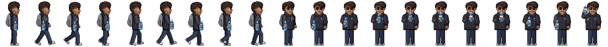

# Sip and Surf

A Chrome extension that keeps you hydrated while you browse. Every so often a pixel buddy walks onto your screen with a water bottle, stops, and asks you to **Sip** or **Snooze**. Sip and Surf also tracks how much you drink each day against a daily target, with history and insights.


## Features

- **Reminder interval** you pick in the popup (10 minutes to 10 hours, presets or custom).
- **Walking buddy:** enters from the far left of the page and takes 8 steps along the bottom of the screen, facing the way it walks. Then it stops, turns to look at you and takes a sip from its bottle, with a sip sound.
- **Sip:** the buddy raises its bottle to you, hops, and leaves. Your sip is logged and the timer resets to 100% of your interval.
- **Snooze:** the buddy turns and walks off to the right, and comes back after exactly 5% of your interval (60 min interval: 3 min snooze).
- **Auto-snooze:** if nobody answers within 60 seconds, the buddy snoozes automatically.
- **Daily intake tracking:** each Sip adds one serving (250 ml by default). Log extra glasses or undo from the popup.
- **History and insights:** today vs target, current and best streak, target hit rate, daily average, how often reminders get a Sip, a daily intake chart with the target line, a drink-by-hour chart, a day-by-day table and CSV export.
- **Works everywhere it can:** on pages where Chrome blocks extensions (`chrome://` pages, the Chrome Web Store), you get a system notification with Sip and Snooze buttons instead.
- **Survives restarts:** settings, timer and history live in `chrome.storage.local`, and the timer runs on `chrome.alarms`. A reminder that came due while Chrome was closed shows a few seconds after Chrome opens.

## Install (developer mode)

1. Download or clone this repo.
2. Open `chrome://extensions` and turn on **Developer mode** (top right).
3. Click **Load unpacked** and pick the repo folder.
4. Pin Sip and Surf to the toolbar and open the popup. The first reminder is 1 hour after install. Click **Remind me now** to see it straight away.

Chrome shows "Read and change all your data on all websites" at install. That's needed because the buddy appears on whatever page you are on without you clicking the extension first. Sip and Surf never reads page content and sends nothing anywhere.

## The character

The buddy is a pixel portrait of ayush, drawn from a photo: straight, slicked dark hair with an 80/20 side part, big round shades with the blue, white and red temple, a long straight nose, a thin moustache, a fuller lower lip, a little stubble on a defined jaw, the black high-collar jacket with its logo patch, and a grey backpack on the back with both straps over the shoulders.

- **Walking:** side view, looking where it's going, with an 8-frame walk cycle (heel strike, knee bend, push-off) and arms swinging opposite the legs. The page moves it exactly one stride per step, so its feet don't slide.
- **Stopping:** it turns through a three-quarter view to face you and makes eye contact.
- **Sip:** the arm lifts the bottle to the chin, the straw goes into the mouth, the water level drops with bubbles rising, then a smile.
- **After you press Sip:** it raises the bottle to you. After Snooze, it turns back and walks off.

`tools/make_character.py` draws all of it. Body parts are vector shapes posed with joint angles, drawn at 8x and reduced to clean pixels, each with its own outline. The faces and hair are placed pixel by pixel. Run `python3 tools/make_character.py` after editing to rebuild `assets/character-sheet.png`.



### Using a different character

You can swap in any character from **one image**, `assets/character-sprite.png`.

1. Delete `assets/character-sheet.json` and `assets/character-sheet.png` so the extension builds frames from your image instead.
2. Draw your character standing, **facing right**, holding the water bottle, on a transparent background. Feet on the bottom edge. Any size works; small pixel art (for example 24 × 32 or 32 × 48) looks crispest.
3. Replace `assets/character-sprite.png` with it (same file name).
4. Reload the extension in `chrome://extensions`.

When the extension starts, it builds the full sprite sheet from that single image (`lib/sprite.js`): 1 idle frame, 4 walk frames (a bob, lean and squash cycle, two steps per cycle) and 6 drink frames (tilts back with the bottle up, with water droplets, then comes back). You don't draw any extra frames. A single image has no front view, so this buddy doesn't turn to face you; it drinks when you press Sip. To change the poses, edit the `POSES` table in `lib/sprite.js`.

The on-screen height is about 180 px (200 px for the included character). Small images scale up by whole numbers so the pixels stay sharp.

## How it works

| File | What it does |
| --- | --- |
| `manifest.json` | Manifest V3. Permissions: `alarms`, `storage`, `scripting`, `notifications`, `offscreen`, `tabs`, and host access to all sites. |
| `background.js` | Service worker. Owns the timer (`chrome.alarms`), shows the reminder in the active tab, handles Sip, Snooze and auto-snooze, and records intake. |
| `lib/state.js` | Settings, timer state and daily history in `chrome.storage.local`. |
| `lib/sprite.js` | Loads the character sheet, or builds one from a single image if there is no sheet. |
| `lib/insights.js` | Streaks, hit rate, averages and CSV export (pure functions, unit tested). |
| `content/overlay.js` | The on-page buddy, inside a closed Shadow DOM so page CSS can't affect it and it can't affect the page. |
| `offscreen/` | Plays `assets/sip.wav`. Service workers can't play audio, so an offscreen document does it. |
| `popup/` | Today's intake, the countdown, and the settings. |
| `history/` | History and insights page (also opens as the extension's options page). |
| `tools/make_character.py` | Draws the character and its full sprite sheet (`assets/character-sheet.png` and `.json`). |
| `tools/make_assets.py` | Regenerates the icons and the sip sound. |

Timer rules:

- **Sip:** next reminder at `now + interval`.
- **Snooze or auto-snooze:** next reminder at `now + interval × 0.05`.
- The shortest interval is 10 minutes, because Chrome alarms can't fire sooner than 30 seconds and 5% of 10 minutes is 30 seconds.

## Development

```sh
npm test                    # unit tests for the insights maths (Node 18+)
python3 tools/make_character.py  # redraw the character sheet (needs pillow and numpy)
python3 tools/make_assets.py     # regenerate icons and sound (needs pillow and numpy)
```

If motion is reduced in your OS settings, the buddy fades in at the stopping point instead of walking.
